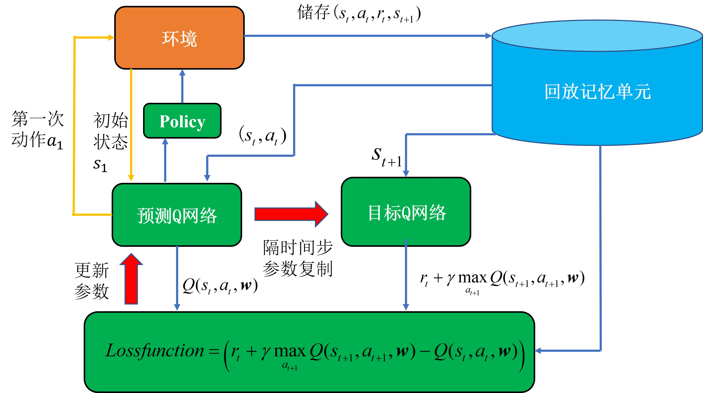

# 🧸 入坑RL两年 目前研究Model-based RL、World Model


[](https://choosealicense.com/licenses/mit/)
[](https://www.python.org/)
[](https://github.com/hujch23/Deep-Reinforcement-Learning/issues)

# 📚 目录

- [强化学习基础概念](#1-强化学习基础概念)  
- [动态规划vs蒙特卡洛vs时序差分](#2动态规划vs蒙特卡洛vs时序差分)
- [Q-learning和Sarsa](#3Q-learning和Sarsa)  
- [DQN算法及变种](#4DQN算法及变种)  
- [策略梯度方法](#5策略梯度方法)  
- [actor-critic方法及变种](#6actor-critic方法及变种)  
- [PPO算法及变种](#7ppo算法及变种)
- [Model-based SOTA 方法](#8model-based-sota-方法) 
- [模仿学习：AIRL、GAIL、扩散策略等](#9模仿学习airl-gail-扩散策略等)
- [一些调参技巧](#10一些调参技巧)  

# 📖1. 强化学习基础概念  

### 1.1 强化学习的基本组成部分有哪些？基本特征有哪些？
  - Agent（智能体） Environment（环境） State（状态）Action（动作） Reward（奖励） Policy（策略）
  -   有试错探索过程，即需要通过探索环境来获取对当前环境的理解
  -   强化学习中的智能体会从环境中获得延迟奖励
  -   强化学习的训练过程中时间非常重要，因为数据都是时间关联的，而不是像监督学习中的数据大部分是满足独立同分布的
  -   强化学习中智能体的动作会影响它从环境中得到的反馈

### 1.2 解释什么是回报（Return）和价值函数（Value Function）？  
  - 回报：从某一时刻开始，未来所有奖励的折扣总和  
  - 价值函数：从某个状态开始，遵循特定策略能够获得的期望回报  

### 1.3 全部可观测（full observability）、完全可观测（fully observed）和部分可观测（partially observed）?
  - 当智能体的状态与环境的状态等价时，我们就称这个环境是全部可观测的
  - 当智能体能够观察到环境的所有状态时，我们称这个环境是完全可观测的
  - 一般智能体不能观察到环境的所有状态时，我们称这个环境是部分可观测的

### 1.4 强化学习的使用场景有哪些呢？
  - 7个字总结就是“多序列决策问题”，或者说是对应的模型未知，需要通过学习逐渐逼近真实模型的问题。并且当前的动作会影响环境的状态，即具有马尔可夫性的问题。同时应满足所有状态是可重复到达的条件，即满足可学习条件

### 1.5 强化学习相对于监督学习为什么训练过程会更加困难？
  - 处理的大多是序列数据，其很难像监督学习的样本一样满足独立同分布条件
  - 有奖励的延迟，即智能体的动作作用在环境中时，环境对于智能体状态的奖励存在延迟，使得反馈不实时
  - 监督学习有正确的标签，模型可以通过标签修正自己的预测来更新模型，而强化学习相当于一个“试错”的过程，其完全根据环境的“反馈”更新对自己最有利的动作

### 1.6 状态和观测有什么关系？
  - 状态是对环境的完整描述，不会隐藏环境信息。观测是对状态的部分描述，可能会遗漏一些信息。在深度强化学习中，我们几乎总是用同一个实值向量、矩阵或者更高阶的张量来表示状态和观测

### 1.7 根据强化学习智能体的不同，我们可以将其分为哪几类？
  - 基于价值的智能体。显式学习的是价值函数，隐式地学习智能体的策略。因为这个策略是从学到的价值函数里面推算出来的
  - 基于策略的智能体。其直接学习策略，即直接给智能体一个状态，它就会输出对应动作的概率。当然在基于策略的智能体里面并没有去学习智能体的价值函数
  - 另外还有一种智能体，它把以上两者结合。把基于价值和基于策略的智能体结合起来就有了演员-评论员智能体。这一类智能体通过学习策略函数和价值函数以及两者的交互得到更佳的状态

### 1.8 强化学习、监督学习和无监督学习三者有什么区别呢？
  - 首先强化学习和无监督学习是不需要有标签样本的，而监督学习需要许多有标签样本来进行模型的构建训练。其次对于强化学习与无监督学习，无监督学习直接基于给定的数据进行建模，寻找数据或特征中隐藏的结构，一般对应聚类问题；强化学习需要通过延迟奖励学习策略来得到模型与目标的距离，这个距离可以通过奖励函数进行定量判断，这里我们可以将奖励函数视为正确目标的一个稀疏、延迟形式。另外，强化学习处理的多是序列数据，样本之间通常具有强相关性，但其很难像监督学习的样本一样满足独立同分布条件

### 1.9 基于策略迭代和基于价值迭代的强化学习方法有什么区别？
  - 基于策略迭代的强化学习方法，智能体会制定一套动作策略，即确定在给定状态下需要采取何种动作，并根据该策略进行操作。强化学习算法直接对策略进行优化，使得制定的策略能够获得最大的奖励；基于价值迭代的强化学习方法，智能体不需要制定显式的策略，它维护一个价值表格或价值函数，并通过这个价值表格或价值函数来选取价值最大的动作
  - 基于价值迭代的方法只能应用在离散的环境下，例如围棋或某些游戏领域，对于行为集合规模庞大或是动作连续的场景，如机器人控制领域，其很难学习到较好的结果（此时基于策略迭代的方法能够根据设定的策略来选择连续的动作)
  - 基于价值迭代的强化学习算法有 Q-learning、Sarsa 等，基于策略迭代的强化学习算法有策略梯度算法等
  - 此外，演员-评论员算法同时使用策略和价值评估来做出决策。其中，智能体会根据策略做出动作，而价值函数会对做出的动作给出价值，这样可以在原有的策略梯度算法的基础上加速学习过程，从而取得更好的效果

### 1.10 Model-based 和 Model-free、 On Policy 和 Off Policy、Online and Offline、Value-based 和 Policy-based
  - Online和Offline，主要的区别在于智能体训练时是否实时与环境进行交互。Online RL 依赖于实时交互，而 Offline RL 则依赖于预先收集的数据（根据数据稀缺程度选择）
  - On-policy 和Off-policy皆属于Online RL，主要的区别在于是否使用与当前策略相同的数据来进行学习。On-policy 仅使用当前策略产生的数据来更新策略，而 Off-policy 可以使用其他策略生成的数据来学习
  - 在强化学习中，所谓的“模型”一般都指的是环境的模型，即环境的动态模型，通常包含两部分：一是状态转移（state transition）函数，二是奖励（reward）函数

### 1.11 强化学习中所谓的损失函数与深度学习中的损失函数有什么区别呢？
  - 深度学习中的损失函数的目的是使预测值和真实值之间的差距尽可能小，而强化学习中的损失函数的目的是使总奖励的期望尽可能大

### 1.12 马尔科夫决策核心词汇
  - 马尔可夫性质（Markov property，MP）：如果某一个过程未来的状态与过去的状态无关，只由现在的状态决定，那么其具有马尔可夫性质。换句话说，一个状态的下一个状态只取决于它的当前状态，而与它当前状态之前的状态都没有关系
  
  - 马尔可夫链（Markov chain）： 概率论和数理统计中具有马尔可夫性质且存在于离散的指数集（index set）和状态空间（state space）内的随机过程（stochastic process）
  - 状态转移矩阵（state transition matrix）：状态转移矩阵类似于条件概率（conditional probability），其表示当智能体到达某状态后，到达其他所有状态的概率。矩阵的每一行描述的是从某节点到达所有其他节点的概率
    
  - 马尔可夫奖励过程（Markov reward process，MRP）： 本质是马尔可夫链加上一个奖励函数。在马尔可夫奖励过程中，状态转移矩阵和它的状态都与马尔可夫链的一样，只多了一个奖励函数。奖励函数是一个期望，即在某一个状态可以获得多大的奖励
  - 范围（horizon）：定义了同一个回合（episode）或者一个完整轨迹的长度，它是由有限个步数决定的
  - 回报（return）：把奖励进行折扣（discounted）求和
  - 贝尔曼方程（Bellman equation）：其定义了当前状态与未来状态的迭代关系，表示当前状态的价值函数可以通过下个状态的价值函数来计算。贝尔曼方程因其提出者、动态规划创始人理查德 $\cdot$ 贝尔曼（Richard Bellman）而得名，同时也被叫作“动态规划方程”
  - 蒙特卡洛算法（Monte Carlo algorithm，MC algorithm）： 在马尔可夫奖励过程中，从特定状态开始生成多条轨迹，计算每条轨迹的折扣总奖励，最后取平均值即为该状态的价值函数估计
  - 动态规划算法（dynamic programming，DP）： 其可用来计算价值函数的值。通过一直迭代对应的贝尔曼方程，最后使其收敛。当最后更新的状态与上一个状态差距不大的时候，动态规划算法的更新就可以停止
  - Q函数（Q-function）： 其定义的是某一个状态和某一个动作所对应的有可能得到的回报的期望
  - 马尔可夫决策过程中的预测问题：即策略评估问题，给定一个马尔可夫决策过程以及一个策略 $\pi$ ，计算它的策略函数，即每个状态的价值函数值是多少。其可以通过动态规划算法解决
  - 马尔可夫决策过程中的控制问题：即寻找一个最佳策略，其输入是马尔可夫决策过程，输出是最佳价值函数（optimal value function）以及最佳策略（optimal policy）。其可以通过动态规划算法解决
  - 最佳价值函数：搜索一种策略 $\pi$ ，使每个状态的价值最大， 就是到达每一个状态的极大值。在极大值中，我们得到的策略是最佳策略。最佳策略使得每个状态的价值函数都取得最大值。所以当我们说某一个马尔可夫决策过程的环境可解时，其实就是我们可以得到一个最佳价值函数

### 1.13 为什么在马尔可夫奖励过程中需要有折扣因子？
  - 数学上的必要性：确保无限时间序列的奖励之和能够收敛、避免累积奖励变成无穷大
  - 反映现实决策偏好：体现"现在的奖励比将来的更有价值"这一现实思维
  - 处理不确定性：通过折扣因子降低远期奖励的权重，更合理地应对不确定性

### 1.14 计算贝尔曼方程的常见方法有哪些，它们有什么区别？
  - 蒙特卡洛方法：可用来计算价值函数的值。
  - 动态规划方法：可用来计算价值函数的值。通过一直迭代对应的贝尔曼方程，最后使其收敛。当最后更新的状态与上一个状态区别不大的时候，通常是小于一个阈值 $\gamma$ 时，更新就可以停止
  - 以上两者的结合方法：我们也可以使用时序差分学习方法，其为动态规划方法和蒙特卡洛方法的结合
  - 具体见2.1 

### 1.15 马尔可夫奖励过程与马尔可夫决策过程的区别是什么？
  - MRP: 状态转移是自动的，由固定的转移概率决定
  - MDP: 状态转移受智能体选择的动作影响，P(s'|s,a)依赖于动作a
  - MRP: R(s)只与状态有关
  - MDP: R(s,a,s')与状态和动作都相关
  - MDP是MRP的扩展，增加了动作选择的能力，使系统从被动观察变为主动决策。

### 1.16 马尔可夫过程是什么？马尔可夫决策过程又是什么？其中马尔可夫最重要的性质是什么呢？
  - 马尔可夫过程是一个二元组 $<S,P>$ ， $S$ 为状态集合， $P$ 为状态转移函数
  - 马尔可夫决策过程是一个五元组 $<S,P,A,R,\gamma>$， 其中 $R$ 表示从 $S$ 到 $S'$ 能够获得的奖励期望， $\gamma$ 为折扣因子， $A$ 为动作集合
  - 马尔可夫最重要的性质是下一个状态只与当前状态有关，与之前的状态无关

### 1.17 如果数据流不具备马尔可夫性质怎么办？应该如何处理？
  - 如果不具备马尔可夫性，即下一个状态与之前的状态也有关，若仅用当前的状态来求解决策过程，势必导致决策的泛化能力变差。为了解决这个问题，可以利用循环神经网络对历史信息建模，获得包含历史信息的状态表征，表征过程也可以使用注意力机制等手段，最后在表征状态空间求解马尔可夫决策过程问题。

### 1.18 写出基于状态价值函数的贝尔曼方程以及基于动作价值函数的贝尔曼方程

  - 基于状态价值函数的贝尔曼方程:
```math
V_{\pi}(s) = \sum_{a}\pi(a|s)\sum_{s',r}p(s',r|s,a)[r(s,a)+\gamma V_{\pi}(s')]
```
  - 基于动作价值函数的贝尔曼方程:
```math
Q_{\pi}(s,a)=\sum_{s',r}p(s',r|s,a)[r(s',a)+\gamma V_{\pi}(s')]
```

### 1.19 一般怎么求解马尔可夫决策过程？
  - 我们求解马尔可夫决策过程时，可以直接求解贝尔曼方程或动态规划方程。但是贝尔曼方程很难求解且计算复杂度较高，所以可以使用动态规划、蒙特卡洛以及时序差分等方法求解

# 2.动态规划vs蒙特卡洛vs时序差分 

#### 2.1 📊 方法概览

| 特性 | 动态规划 (DP) | 蒙特卡洛 (MC) | 时序差分 (TD) |
|------|--------------|--------------|--------------|
| 需要环境模型 | ✅ 需要完整模型 | ❌ 不需要 | ❌ 不需要 |
| 学习方式 | 自举学习 | 采样学习 | 自举+采样 |
| 更新时机 | 每步更新 | 回合结束 | 每步更新 |
| 计算复杂度 | 较高 | 中等 | 较低 |
| 收敛速度 | 快 | 慢 | 中等 |
| 特点 | 理论完备但计算昂贵	 | 无偏但方差大 | 平衡偏差和方差，实践最常用 |

动态规划有两种主要方法：策略迭代（Policy Iteration）和值迭代（Value Iteration）。让我详细解释：
- 策略迭代分两步走：首先评估当前策略的好坏（计算在当前策略下每个状态的价值），然后基于这个评估来改进策略（选择能获得更高价值的动作）。这两步不断重复，直到策略不能再改进为止。就像不断调整下棋策略，每次都先评估当前策略的效果，再做出改进。
- 值迭代则更直接：它直接计算每个状态的最优价值，不用分成评估和改进两步。它假设每次都选择能带来最大价值的动作，不断更新状态的价值，直到价值稳定下来。最后根据这些价值选出最优策略。这就像直接计算每个棋局的最佳价值，最后根据这些价值决定怎么走棋。

#### 2.2 🔍 主要区别

1. **环境模型要求**  DP：需要完整的环境模型（状态转移概率和奖励函数）、MC：只需要能够采样经验 、TD：只需要能够采样经验
2. **学习特点**  DP：基于状态转移和奖励的确定性计算、MC：基于完整回合的实际回报、TD：结合DP的自举思想和MC的采样思想
3. **更新机制**  DP：系统地更新所有状态、MC：回合结束后才能更新、TD：可以在线学习，即时更新

#### 2.3💡 共同点

1. **基本框架** 都遵循贝尔曼方程、都是迭代式的价值更新方法、都能用于策略评估和策略改进
2. **目标** 都致力于估计价值函数、都能用于寻找最优策略、都能收敛到最优解（在适当条件下）

# 3.Q-learning和Sarsa

#### 3.1 Q-learning 和 Sarsa区别？
  - 首先，Q学习是异策略的时序差分学习方法，而 Sarsa 算法是同策略的时序差分学习方法
  - 其次，Sarsa算法在更新Q表格的时候所用到的 $a'$ 是获取下一个Q值时一定会执行的动作。这个动作有可能是用 $\varepsilon$-贪心方法采样出来的，也有可能是 $\mathrm{max}_Q$ 对应的动作，甚至是随机动作。
  - 但是Q学习在更新Q表格的时候所用到的Q值 $Q(S',a')$ 对应的动作不一定是下一步会执行的动作，因为下一步实际会执行的动作可能是因为进一步的探索而得到的。Q学习默认的动作不是通过行为策略来选取的，它默认 $a'$ 为最佳策略对应的动作，所以Q学习算法在更新的时候，不需要传入 $a'$ ，即 $a_{t+1}$ 。
  - 更新公式的对比（区别只在目标计算部分），Sarsa算法的公式：)， Q学习算法的公式：)， 总结起来，Sarsa算法实际上是用固有的策略产生 (S, A, R, S', A') 这一条轨迹，然后使用 Q(s<sub>t+1</sub>, a<sub>t+1</sub>) 更新原本的Q值 Q(s<sub>t</sub>, a<sub>t</sub>)。但是Q学习算法并不需要知道实际上选择的动作，它默认下一个动作就是Q值最大的那个动作。所以Sarsa算法的动作通常会更加“保守胆小”，而对应的Q学习算法的动作会更加“莽撞激进”。

#### 3.2 同策略和异策略的区别是什么？ 
  - Sarsa算法就是一个典型的同策略算法，它只用一个 $\pi$ ，为了兼顾探索和开发，它在训练的时候会显得有点儿“胆小怕事”。它在解决悬崖寻路问题的时候，会尽可能地远离悬崖边，确保哪怕自己不小心向未知区域探索了一些，也还是处在安全区域内，不至于掉入悬崖中
  - Q学习算法是一个比较典型的异策略算法，它有目标策略（target policy），用 $\pi$ 来表示。此外还有行为策略（behavior policy），用 $\mu$ 来表示。它分离了目标策略与行为策略，使得其可以大胆地用行为策略探索得到的经验轨迹来优化目标策略。这样智能体就更有可能探索到最优的策略
  - 比较Q学习算法和Sarsa算法的更新公式可以发现，Sarsa算法并没有选取最大值的操作。因此，Q学习算法是非常激进的，其希望每一步都获得最大的奖励；Sarsa算法则相对来说偏保守，会选择一条相对安全的迭代路线

#### 💡 补充知识：
**资格迹**：用“迹”反应每个状态进行学习变化的资格（频率、离当前状态的时间距离），包括累积资格迹（访问累积否则递减）、替代资格迹（访问取1否则递减）

https://zhuanlan.zhihu.com/p/2575884247

**N步Q-learning与重要性采样的数学推导**

**1. N步回报的定义**

在n步Q-learning中，n步回报 $G_t^{(n)}$ 定义为：

$G_t^{(n)} = R_{t+1} + \gamma R_{t+2} + \gamma^2 R_{t+3} + ... + \gamma^{n-1}R_{t+n} + \gamma^n \max_a Q(S_{t+n}, a)$

其中：
- $R_t$ 是在时间步t获得的即时奖励
- $\gamma$ 是折扣因子
- $Q(S_{t+n}, a)$ 是状态-动作值函数
- $n$ 是步数

**2. 重要性采样比率**

当行为策略 $\mu$ 与目标策略 $\pi$ 不同时，重要性采样比率 $\rho_t$ 定义为：

$\rho_t = \frac{\pi(A_t|S_t)}{\mu(A_t|S_t)}$

其中：
- $\pi(A_t|S_t)$ 是目标策略选择动作 $A_t$ 的概率
- $\mu(A_t|S_t)$ 是行为策略选择动作 $A_t$ 的概率

**3. n步累积重要性权重**

对于n步序列，累积重要性权重 $\rho_{t:t+n-1}$ 为：

$\rho_{t:t+n-1} = \prod_{k=t}^{t+n-1} \rho_k = \prod_{k=t}^{t+n-1} \frac{\pi(A_k|S_k)}{\mu(A_k|S_k)}$

**4. 带重要性采样的n步Q-learning更新**

Q值更新公式：

$Q(S_t,A_t) \leftarrow Q(S_t,A_t) + \alpha \rho_{t:t+n-1}[G_t^{(n)} - Q(S_t,A_t)]$

展开后：

$Q(S_t,A_t) \leftarrow Q(S_t,A_t) + \alpha \prod_{k=t}^{t+n-1} \frac{\pi(A_k|S_k)}{\mu(A_k|S_k)} [R_{t+1} + \gamma R_{t+2} + ... + \gamma^{n-1}R_{t+n} + \gamma^n \max_a Q(S_{t+n}, a) - Q(S_t,A_t)]$

**5. 方差分析**

重要性采样比率的方差：

$Var(\rho_{t:t+n-1}) = E[(\prod_{k=t}^{t+n-1} \frac{\pi(A_k|S_k)}{\mu(A_k|S_k)})^2] - (E[\prod_{k=t}^{t+n-1} \frac{\pi(A_k|S_k)}{\mu(A_k|S_k)}])^2$

**6. 截断重要性采样**

为控制方差，使用截断重要性采样：

$\rho_{t:t+n-1}^c = \min(c, \prod_{k=t}^{t+n-1} \frac{\pi(A_k|S_k)}{\mu(A_k|S_k)})$

其中 $c$ 是截断阈值。

**Tree Backup避免重要性采样高方差**
$G_{t:t+n} = R_{t+1} + γ \sum_{a \in \mathcal{A}} π(a|S_{t+1}) [ Q(S_{t+1}, a) + (a = A_{t+1}) ( G_{t+1:t+n} - Q(S_{t+1}, a) ) ]  $
                                                 

# 4.DQN算法及变种

 

#### 4.1 深度Q网络是什么？其两个关键性的技巧分别是什么？
深度Q网络（deep Q-network，DQN）：基于深度学习的Q学习算法，其结合了价值函数近似（value function approximation）与神经网络技术，并采用目标网络和经验回放等方法进行网络的训练


#### 4.2 深度Q网络中的两个技巧————目标网络和经验回放，其具体作用是什么呢？

经验回放(Experience Replay)：把智能体的经验(状态、动作、奖励、下一状态)存储在一个缓冲池中，训练时随机抽取一批经验进行学习，解决了样本相关性问题
目标网络(Target Network)：主网络用于选择动作和更新，目标网络用于计算目标Q值，目标网络参数定期从主网络复制，解决了训练不稳定问题

#### 4.3 不打破数据相关性，神经网络的训练效果为什么就不好？
在神经网络中通常使用随机梯度下降法。随机的意思是我们随机选择一些样本来增量式地估计梯度，比如常用的批量训练方法。如果样本是相关的，就意味着前后两个批量很可能也是相关的，那么估计的梯度也会呈现出某种相关性。但是在极端条件下，后面的梯度估计可能会抵消掉前面的梯度估计量，从而使得训练难以收敛

#### 4.4 深度Q网络都有哪些变种？引入状态奖励的是哪种？
深度Q网络有3个经典的变种：双深度Q网络、竞争深度Q网络、优先级双深度Q网络。
（1）双深度Q网络：将动作选择和价值估计分开，避免Q值被过高估计。
（2）竞争深度Q网络：将Q值分解为状态价值和优势函数，得到更多有用信息。
（3）优先级双深度Q网络：将经验池中的经验按照优先级进行采样。

#### 4.5 深度Q网络相比基于策略梯度的方法为什么训练效果更好、更平稳？
在深度Q网络中，只要能够估计出Q函数，就可以找到一个比较好的策略。同样地，只要能够估计出Q函数，就可以增强对应的策略。因为估计Q函数是一个比较容易的**回归问题**，在这个回归问题中，我们可以时刻观察模型训练的效果是不是越来越好（一般情况下我们只需要关注回归的损失有没有下降，就可以判断模型学习得好不好），所以估计Q函数相较于学习一个策略来说是比较容易的。只需要估计Q函数，就可以保证现在一定会得到比较好的策略，同样其也比较容易操作。对比来说，策略梯度方法中的优化目标是最大化总回报，但是我们很难找到一个明确的损失函数来进行优化，其本质上是一个策略搜索问题，也就是一个**无约束的优化问题**

#### 4.6 DQN也是基于异策略为什么不需要重要性采样？
DQN虽然是off-policy，但因为其更新机制是基于贝尔曼方程的直接更新，不需要估计策略的期望，所以不需要使用重要性采样来修正分布差异

#### 4.7 DQN如何实现连续动作空间？
如果动作空间维度低，可以用动作离散化、NAF (Normalized Advantage Functions)，将Q函数分解，其中A(s,a)的设计是关键：A(s,a) = -1/2 (a - μ(s))^T P(s) (a - μ(s))，μ(s): 最优动作的均值，P(s)保证正定性质,使得A(s,a)在a=μ(s)时取得最大值


# 5.策略梯度方法 

**目标：** 回报最大化（策略梯度是无偏的但方差大，值函数逼近使用差分误差，有偏但方差小），采用随机梯度上升

#### 5.1 手动推导一下策略梯度公式的计算过程


#### 5.2 对于策略梯度的两种方法，蒙特卡洛强化学习和时序差分强化学习两种方法有什么联系和区别？
蒙特卡洛方法通过完整轨迹计算回报，更新慢但无偏差，适合回合制任务；时序差分方法利用当前回报和估计值逐步更新，更新快但有偏差，适合持续任务

#### 5.3 描述REINFORCE算法的计算过程


# 6.Actor-Critic方法及变种  

**定义：** Actor-Critic是一种结合了策略网络(Actor)和值函数网络(Critic)的强化学习方法。Actor负责根据当前状态选择动作，就像一个决策者；Critic负责评估状态或状态-动作对的价值，就像一个评论家。这两个网络相互配合：Actor做出决策，Critic给出评价，Actor根据评价改进决策

**与生成对抗网络的联系：** GAN中，生成器试图骗过判别器，判别器试图分辨真假；
Actor-Critic中，Actor和Critic是合作关系，Critic帮助Actor提升性能；
GAN的两个网络是对抗的，而Actor-Critic的两个网络是互补的；
GAN主要用于生成任务，Actor-Critic用于解决决策问题

#### 6.1 actor-critic方法有何优点呢？完整的actor-critic方法的工作流程是怎样的？在实现actor-critic方法的时候有哪些技巧？

Actor-Critic方法巧妙地结合了策略梯度和值函数方法的优势，既能像策略梯度那样直接优化策略并处理连续动作空间，又利用值函数来降低方差提供更稳定的训练，同时具备在线学习能力，可以进行单步更新而不需要等待完整轨迹，这种结构还提供了很好的灵活性，允许独立设计Actor和Critic网络并方便地集成各种改进技巧
首先初始化Actor和Critic网络，然后在每个时间步，Actor观察当前状态并输出动作概率分布，从中采样得到具体动作并与环境交互获得奖励和下一状态，Critic则负责计算当前和下一状态的值函数估计，用于计算TD误差，最后使用这个TD误差既作为Critic的学习目标来更新值函数估计，又作为Actor的优势函数来指导策略改进，如此循环往复直至收敛
网络设计上可以共享特征提取层并根据任务特点设计输出层；为提高训练稳定性，建议使用目标网络、多步TD误差和熵正则化；在探索策略上可以添加适当的动作噪声和参数空间噪声；可以引入优先级经验回放来提高样本效率

#### 6.2 简述一下异步优势演员-评论员算法（A3C），另外A3C是同策略还是异策略
A3C (Asynchronous Advantage Actor-Critic) 的核心思想是让多个工作线程并行学习，每个线程都有自己的环境副本和网络副本，独立收集经验并计算梯度。这些线程会定期将梯度更新到全局网络，然后再从全局网络同步最新参数。这种异步并行的方式大大提高了训练效率，同时不同环境的多样性也增强了算法的稳定性。
A3C是同策略(on-policy)算法：使用当前策略收集数据，并用这些数据直接更新同一个策略

#### 6.3 A3C算法具体是如何异步更新的？
有一个全局网络（包含Actor和Critic）作为主网络，同时运行多个工作线程，每个线程都有自己的网络副本和环境副本。首先从全局网络复制最新参数到自己的网络副本
，在自己的环境中收集一定步数的经验（通常是n步）
，使用收集到的经验计算梯度
，将计算出的梯度异步提交到全局网络
，定期再次从全局网络同步最新参数

#### 6.4 简述A3C算法的优势函数
A3C算法的优势函数采用了n步回报的方式来估计Q值，具体是将n步内收集到的实际奖励r₁到rₙ进行折扣累加，再加上对n步后状态的值函数估计V(sₙ)，得到Q值估计，然后用这个Q值减去当前状态的值函数估计V(s₀)得到优势值，这种设计既利用了实际收集到的奖励信息，又通过值函数估计提供了长期回报的预测，有效平衡了估计的偏差和方差，使得策略更新更加准确和稳定


#### 6.5 A3C算法的更新公式


#### 6.6 对于连续动作的控制空间和离散动作的控制空间，如果我们都采取策略网络，应该分别如何操作？
要输出离散动作，最后输出的激活函数使用 Softmax 即可。其可以保证输出的是动作概率，而且所有的动作概率加和为1，要输出连续的动作，可以在输出层中加一层tanh激活函数，其可以把输出限制到[-1,1]。我们得到这个输出后，就可以根据实际动作的一个范围再做缩放，然后将其输出给环境

#### 6.7 请简述一下深度确定性策略梯度算法（DDPG）
深度确定性策略梯度算法使用演员-评论员结构，但是输出的不是动作的概率，而是具体动作，其可以用于连续动作的预测。优化的目的是将深度Q网络扩展到连续的动作空间。另外，其含义如其名：
（1）深度是因为用了深度神经网络；
（2）确定性表示其输出的是一个确定的动作，可以用于连续动作的环境；
（3）策略梯度代表的是它用到的是策略网络。强化算法每个回合就会更新一次网络，但是深度确定性策略梯度算法每个步骤都会更新一次策略网络，它是一个单步更新的策略网络


#### 6.8 深度确定性策略梯度算法是同策略算法还是异策略算法？请说明具体原因并分析
异策略算法。（1）深度确定性策略梯度算法是优化的深度Q网络，其使用了经验回放，所以为异策略算法。（2）因为深度确定性策略梯度算法为了保证一定的探索，对输出动作加了一定的噪声，行为策略不再是优化的策略

#### 6.9 是否了解过分布的分布式深度确定性策略梯度算法（distributed distributional deep deterministic policy gradient，D4PG）呢？
分布的分布式深度确定性策略梯度算法（distributed distributional deep deterministic policy gradient，D4PG)，相对于深度确定性策略梯度算法，其优化部分如下。 
（1）分布式评论员：不再只估计Q值的期望值，而是估计期望Q值的分布，即将期望Q值作为一个随机变量来估计；
（2）N步累计回报：计算时序差分误差时，D4PG计算的是N步的时序差分目标值而不仅仅只有一步，这样就可以考虑未来更多步骤的回报；
（3）多个分布式并行演员：D4PG使用$K$个独立的演员并行收集训练数据并存储到同一个回放缓冲区中；
（4）优先经验回放（prioritized experience replay，PER）：使用一个非均匀概率从回放缓冲区中进行数据采样

#### 6.10 DDPG算法的第二个D为什么要确定？
DDPG算法中的"Deterministic"（确定性）主要是为了提高计算效率和简化策略梯度的计算过程，因为确定性策略直接输出具体的动作值而不是概率分布，避免了在高维连续动作空间中进行采样的复杂计算，同时也简化了策略梯度的数学推导；虽然策略是确定性的，但DDPG通过在动作上添加探索噪声（如OU噪声或高斯噪声）来保证足够的探索，随着训练进行可以逐渐减小噪声强度，这样既保持了确定性策略的优势，又不失探索能力

#### 6.11 请简述一下双延迟深度确定性策略梯度TD3算法
TD3（Twin Delayed Deep Deterministic Policy Gradient）算法是DDPG的改进版本，首先引入了双Q网络机制，使用两个Q网络来估计值函数，并取两个Q值中的较小值来减少过估计问题，这类似于Double DQN的思想，但采用了两个完全独立的Q网络

TD3的第二个重要改进是延迟更新机制，通过降低策略网络和目标网络的更新频率（通常每更新2次Q网络才更新1次策略网络），来减少策略更新的方差，使训练过程更加稳定。同时，算法还引入了目标策略平滑技术，在计算目标Q值时给目标动作添加被裁剪的噪声，这种正则化使得值函数更平滑，能够有效减少策略错误

TD3保留了DDPG的一些核心特性，如确定性策略、经验回放和软更新等机制，但通过上述三个关键改进，显著提升了算法在连续动作空间任务中的性能表现。实验表明，TD3在多个连续控制任务中都能取得比DDPG更好的效果，而且训练过程更加稳定，更不容易出现过拟合现

# 7.PPO算法及变种  


#### 7.1 基于同策略的策略梯度有什么可改进之处？
经典策略梯度的大部分时间花在数据采样上，即当我们的智能体与环境交互后，我们就要进行策略模型的更新。但是对于一个回合我们仅能更新策略模型一次，更新完后我们就要花时间重新采样数据，然后才能再次进行如上的更新。

所以我们可以使用异策略的方法，即使用另一个不同的策略和演员，与环境进行交互并用所采样的数据进行原先策略的更新。这样等价于使用同一组数据，在同一个回合，我们对整个策略模型更新了多次，这样会更加有效率。

#### 7.2 请简述下PPO算法。其与TRPO算法有何关系呢?
PPO (Proximal Policy Optimization) 算法本质上是TRPO (Trust Region Policy Optimization) 的一个简化版本，它保留了TRPO的核心思想（限制策略更新步长），两者都致力于解决同一个问题：如何在保证策略更新稳定性的同时实现策略改进。TRPO的核心思想：通过KL散度约束来限制策略更新，需要复杂的二阶优化；PPO：使用概率比率裁剪，只需要一阶优化（梯度下降）

#### 7.3 近端策略优化中的KL散度指的是什么？
本质来说，KL散度是一个函数，其度量的是两个动作间的行为距离，而不是参数距离。这里的行为距离可以理解为在相同状态下输出动作的差距（概率分布上的差距），概率分布即KL散度

#### 7.4 PPO算法运用了clip函数限制取值范围，为什么还要加上min呢？
如果只有clip而没有min：正优势情况下，策略可能会过度增加某些动作的概率（例如很小的优势因为截断变大），负优势情况下，策略可能会过度减少某些动作的概率，可能导致训练不稳定或策略崩溃。

#### 7.5 AC架构与PPO之间的区别？
Actor-Critic是一个基础架构，由Actor负责策略学习（选择动作）和Critic负责价值评估（评价状态）两个网络组成，使用基本的策略梯度进行更新，而PPO是在此架构基础上的改进算法，它通过引入概率比率裁剪机制（clip）来限制策略更新的幅度，并使用min操作选择更保守的策略更新，同时允许多轮更新来提高样本利用效率，这些改进使得PPO比基础AC架构具有更好的训练稳定性和性能表现，特别适合处理复杂的强化学习任务。补充一点：PPO保持了AC架构的优点（同时学习策略和价值），同时解决了AC架构容易不稳定的缺点（通过限制策略更新步长）

#### 7.6 PPO的上一个策略收集到的经验可以用多少次？
PPO在使用上一个策略收集的经验数据时需要注意"重要性采样偏差"的问题。随着策略更新，新旧策略的差异会逐渐增大，如果重复使用太多次，会导致学习效果变差，OpenAI的PPO实现默认使用K=10个epoch，DeepMind的实现通常使用K=3-5个epoch

#### 7.7 RLHF 训练过程是怎么样的？DPO和PPO有什么区别？DPO 如何解决RLHF存在问题？


#### 7.8 DPO训练可能会出现什么问题？
DPO虽然简化了RLHF的训练过程，但仍面临几个主要挑战：首先是数据质量问题，包括人类偏好标注的一致性和覆盖度不足；其次是训练过程中可能出现模式崩溃（Mode Collapse，即输出变得单调缺乏多样性）和过拟合问题；第三是优化过程中可能遇到的梯度不稳定和训练不稳定问题；最后是偏好建模的固有难题，如偏好传递性缺失（A优于B，B优于C，但A不一定优于C）和复杂的上下文依赖性。为了缓解这些问题，通常需要采取改进数据质量、混合训练目标、添加正则化约束等措施


#### 7.9 在GRPO算法中，稳定训练的Clip方法和KL penalty方法分别是什么？GRPO同时使用Clip和KL penalty，与只用其中一种方法或是不用任何方法相比，有何优势和劣势？
- Clip通过截取新旧策略的重要性采样比率直接限制更新幅度。KL penalty通过KL散度惩罚间接约束策略变化
- GRPO同时使用Clip和KL penalty的优势：同时使用两种稳定训练的方法可以让训练更稳定
- GRPO同时使用Clip和KL penalty的劣势：需要计算截取、KL散度并调节惩罚强度，增加了实现的复杂度和计算量

#### 7.10 GRPO算法和PPO算法有何区别？
GRPO算法不用Critic网络，而是对一组样本的奖励进行标准化来计算优势。不用Critic网络减少了计算和存储资源，特别适合于训练参数量巨大的大模型

#### 7.11 GRPO算法与PPO算法相比有哪些优势？有哪些劣势？
- GRPO与PPO相比的优势：无需Critic网络模型，节约计算和存储资源。组内对比能可以利用到过程奖励。
- GRPO与PPO相比的劣势：若组内样本质量低（如全为错误答案或是多样性关系不足），标准化后的奖励可能无法反映真实优势，无法有效指示改进方向

#### 7.12 为什么DeepSeek训练使用GRPO算法而不是PPO算法？
在DeepSeek训练的过程中，奖励模型主要是基于规则的（比如准确性奖励和格式奖励），这些的奖励形式更为简单，不容易受到reward hacking的影响。所以，DeepSeek训练过程中可以采用不需要维护Critic的GRPO算法来提升训练速度和资源消耗量（比如节约显存）

#### 7.13 在KL惩罚方法中，固定惩罚强度和动态调整惩罚强度各有何优缺点？
固定惩罚强度计算更加简单，但是对参数更加敏感：惩罚过强会限制探索，惩罚过弱会影响训练稳定性。动态调整惩罚强度可使KL散度维持在目标范围内，避免惩罚过强或过弱。不过需要额外的实现和计算来实现动态调整

# 8.Model-based SOTA 方法
蒙特卡洛树搜索 = MinMax Tree Search + Monte Carlo Rollout


### 8.1 AlphaGo


### 8.2 AlphaZero


### 8.3 Muzero


#### 8.4 AlphaGo 和 AlphaZero 的主要区别是什么？


#### 8.5 AlphaZero 为什么能泛化到多个游戏？


#### 8.6 AlphaZero 的训练是否可以应用于实际工程问题？


#### 8.7 AlphaZero 是否可以解决非博弈类问题，如自动驾驶或医学诊断？


#### 8.8 MCTS 的计算复杂度如何影响 AlphaZero 的决策速度？


### 8.9 Dreamer系列
Dreamer 是一种基于模型的强化学习（Model-Based Reinforcement Learning, MBRL）算法，由 DeepMind 提出。它的核心思想是通过学习一个潜在的环境模型（Latent Dynamics Model），在潜在空间中进行规划和决策，从而实现高效的强化学习

**DreamerV2**的核心公式通过以下方式实现：

- 世界模型学习：通过图像、奖励和折扣因子的预测损失，学习环境的潜在动态、使用 KL 散度正则化，确保潜变量的分布具有泛化能力、KL 平衡技术避免了未充分训练的先验分布对后验分布的过度约束
- 行为学习：使用 Actor-Critic 方法在潜变量空间中优化策略、Critic 通过 λ-目标值估计未来奖励总和、Actor 结合 Reinforce 梯度和动态反向传播，优化策略以最大化 Critic 的预测值
- 分类VAE：将每张图像转换为 32 个分布，每个分布有 32 个类，其含义随着世界模型的学习而自动确定。这One-Hot 向量从这些分布中采样的 sparse 表示形式被连接成一个稀疏表示形式，该表示形式被传递给 recurrent 状态


# 9.模仿学习：AIRL GAIL 扩散策略等 


# 9.1 Diffusion Policy
2023 RSS Diffusion Policy: Visuomotor Policy Learning via Action Diffusion，项目链接：https://github.com/real-stanford/diffusion_policy

**挑战：** 多模式multimodal distributions, 序列相关性sequential correlation, 高精度and the requirement of high precision

Diffusion Policy 的核心是将机器人策略学习建模为一种基于扩散模型的生成过程。具体来说：
- 通过学习动作评分函数的梯度，并在该梯度场上执行随机朗之万动力学采样（Stochastic Langevin Dynamics sampling），Diffusion Policy 可以表达任意可归一化的分布
- 通过直接学习能量函数的梯度，Diffusion Policy 避免了传统能量模型中对归一化常数进行负采样的需求，从而实现了更稳定的训练过程
- 高维动作空间：扩散模型在高维输出空间（如图像生成）中表现优异，这使得 Diffusion Policy 能够预测长时间的动作序列，保证时间一致性

论文提出了以下技术改进以适应机器人视觉运动控制任务：
- **闭环动作序列预测**：结合扩散模型的长时间动作序列预测能力与回退视界控制（Receding Horizon Control），实现了动作的闭环规划，既保证了长时间规划的连贯性，又能快速响应环境变化
- **视觉条件化**（Visual Conditioning）：将视觉观测作为条件输入，而不是联合分布的一部分，从而减少计算开销并提高实时推理能力
- **时间序列扩散 Transformer**：提出了一种基于 Transformer 的扩散网络，解决了传统 CNN 模型在高频动作变化任务中的过平滑问题
  
消融实验表明：
- **观察窗口长度**：对于视觉输入，较短的观察窗口（如 2 帧）效果最佳。
- **动作预测长度**：较长的动作预测序列有助于时间一致性，但会降低响应速度，最佳长度为 8 步。
- **视觉编码器**：端到端训练的视觉编码器优于预训练模型（如 ImageNet 或 R3M）


# 10.一些调参技巧  


